# Tier 1 - Basic Quality
| Bauxite  | Coal | Hematite  | Quartz |
| :---: | :---: | :---: | :---: |
| [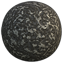](#)  | [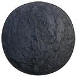](#)  | [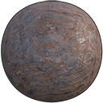](#)  | [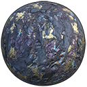](#)  |
| Pure Aluminum  | 	Pure Carbon  | Pure Iron  | Pure Silicon  |

# Tier 2 - Uncommon Quality
[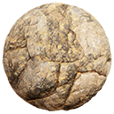](#)
[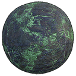](#)
[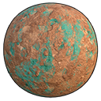](#)
[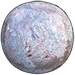](#)

# Tier 3 - Advanced Quality
[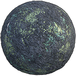](#)
[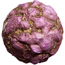](#)
[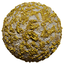](#)
[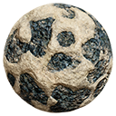](#)

# Tier 4 - Rare Quality
[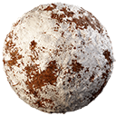](#)
[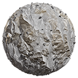](#)
[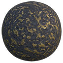](#)
[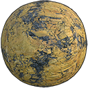](#)

# Tier 5 - Exotic Quality
[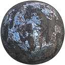](#)
[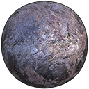](#)
[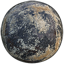](#)
[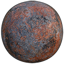](#)

# Others
[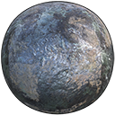](#)
[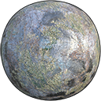](#)
[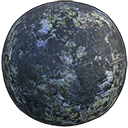](#)
[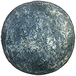](#)
[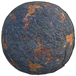](#)
[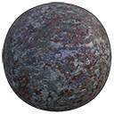](#)
[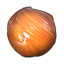](#)
[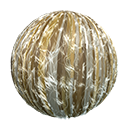](#)
[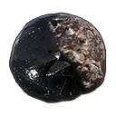](#)
[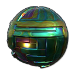](#)
[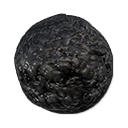](#)
[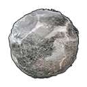](#)
