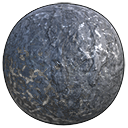

# Tier 1 - Basic Quality
| Bauxite  | Coal | Hematite  | Quartz |
| :---: | :---: | :---: | :---: |
|   |   |   |   |
| Pure Aluminum  | 	Pure Carbon  | Pure Iron  | Pure Silicon  |

# Tier 2 - Uncommon Quality

# Tier 3 - Advanced Quality

# Tier 4 - Rare Quality

# Tier 5 - Exotic Quality

# Others

